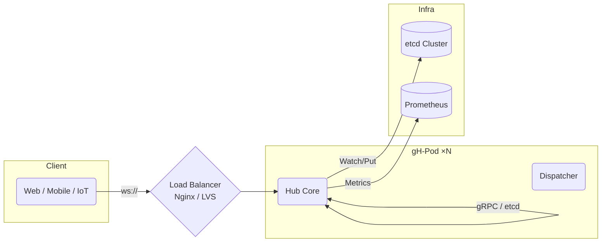

# gohub 开源项目计划（更新版）

> **版本：2025‑05‑15**
> *此次更新：改用 ****etcd**** 作为唯一的集群消息总线，实现单机/分布式双模式。*

---

## 目录

1. [项目简介](#项目简介)
2. [一期目标（2025‑Q2）](#一期目标2025q2)

    1. [核心能力](#核心能力)
    2. [技术栈与架构](#技术栈与架构)
    3. [目录结构](#目录结构)
    4. [测试与质量保障](#测试与质量保障)
    5. [安全 & 性能](#安全--性能)
3. [二期目标（2025‑Q3）](#二期目标2025q3)
4. [长期演进方向](#长期演进方向)
5. [许可证](#许可证)

---

## 项目简介

**gohub** 是一款用 **Golang** 编写、开源、可生产运行的 **WebSocket Hub**。面向 Golang 新手提供「一键可跑、易于阅读」的代码，同时满足企业级部署需要，可在单机或多实例集群模式下支撑 **万级长连接**。项目采用 **MIT** 许可证，所有人可自由使用、修改、商用。

---

## 一期目标（2025‑Q2）

### 核心能力

| 类别    | 功能项                 | 说明                                                                                                                  |
| ----- | ------------------- | ------------------------------------------------------------------------------------------------------------------- |
| 连接管理  | 🔗 **单机&集群** 双模式    | *单机模式*：进程内 `Hub` 管理所有连接；*集群模式*：多实例通过 **etcd Watch/Put** 同步广播或点对点消息，保证水平扩展（首版实现 `EtcdBus`，抽象 `MessageBus` 接口便于后续替换）。 |
| 消息模型  | 🚀 广播 / 点对点 / 自定义路由 | 统一 `Message` 结构（`message_id` + `data`），由 **Dispatcher** 解析路由。                                                       |
| 心跳保活  | ❤️ 服务器 & 客户端双向心跳    | WebSocket Ping/Pong + 应用层 `MsgPing`。超时自动断链。                                                                         |
| 错误恢复  | 🛡️ 连接异常自动清理        | `shutdown()` 确保关闭、日志、资源回收。                                                                                          |
| 热插拔配置 | ⚙️ YAML/ENV         | 读写超时、缓冲区、心跳间隔、是否启用集群等均可热加载。                                                                                         |
| 运维可观测 | 📈 Prometheus 指标    | 连接数、QPS、延迟、GC、goroutine 等关键指标，附 Grafana 示例仪表盘。                                                                      |

> **交付里程碑**
>
> 1. **M1‑Alpha (5/31)**：单机版功能完备，单元测试覆盖率 ≥ 80%。
> 2. **M2‑Beta (6/15)**：集群模式 **etcd 适配完成**；端到端压测达到 10 k conns / 实例，广播 5 k msg/s 无丢失。
> 3. **M3‑RC (6/30)**：接口冻结、文档完善、发布 v1.0.0。

### 技术栈与架构



* **WS 框架**：Gorilla WebSocket；抽象 `WSConn` 接口，兼容 nhooyr/websocket。
* **集群消息总线**：接口 `MessageBus`，首版实现 \`\`（Key 设计：`/gohub/broadcast`、`/gohub/unicast/{clientID}`，事件通过 `Watch` 分发）。
* **配置**：`viper` 读取 `config.yaml` + ENV。
* **日志**：`log/slog` JSON 输出，支持动态级别。
* **监控**：`promhttp` 导出指标。

### 目录结构

```text
cmd/gohub/           # main, CLI
internal/
  hub/               # Hub & Client
  bus/               # MessageBus 接口 + EtcdBus 实现
  websocket/         # WS 适配 & 协程
  dispatcher/        # 消息路由
  handlers/          # 业务处理器(示例 ping/chat)
configs/             # 默认 config.yaml
frontend/            # React demo (二期)
scripts/             # 压测 & 运维脚本
```

### 测试与质量保障

* **测试金字塔**：

    * 单元测试 (`go test`) 覆盖核心算法和错误分支。
    * 集成测试：启动 N 实例 + **嵌入式 etcd**，使用 `websocket.Dialer` 并发 1 k 客户端验证广播一致性。
    * 性能基准：`go test -bench`；`k6`/自研脚本持续压测。
* **CI/CD**：GitHub Actions → lint + test + build + Docker multi‑arch image。
* **覆盖率门禁**：PR 必须 ≥ 80%，关键目录 ≥ 90%。

### 安全 & 性能

* **TLS/WSS** 支持，示例 Nginx 配置。
* **Origin 校验 & Token 鉴权** 钩子。
* **Backpressure**：发送队列满 → 客户端可选丢包或踢下线。
* **批量写优化**：`SetWriteDeadline` + 聚合小消息。

---

## 二期目标（2025‑Q3）

| 功能         | 说明                                    |
| ---------- | ------------------------------------- |
| React 前端示例 | 聊天室 UI，自动重连，心跳提示，TypeScript + Vite。   |
| 分组/主题订阅    | Hub 支持 `room` 概念，客户端可 join/leave。     |
| SDK & 示例   | JS/TS SDK，Android Kotlin 示例，嵌入式 C 示例。 |
| 运维 UI      | 简易控制台：实时连接数、房间列表、踢人、限流。               |

---

## 长期演进方向

* **消息持久化**：可插拔存储层（PostgreSQL、MongoDB、Kafka Topic 等）。
* **端到端加密**：支持客户端本地加解密。
* **WebTransport / HTTP3**：跟进下一代实时协议。

---

## 许可证

本项目采用 **MIT License** ，允许自由使用、修改、再分发，但需保留原作者版权声明。

> 欢迎 Star 🎉，Issue & PR❤️ ！
